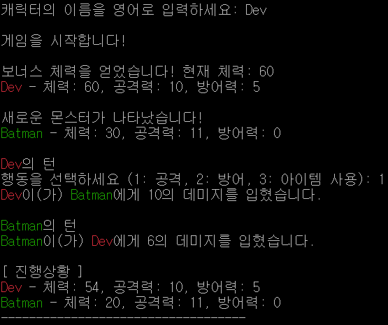

# 콘솔 RPG 게임

## 📣프로젝트 개요
터미널로 입력 값을 받아 텍스트 게임을 하는 프로그램입니다.

 

## 📆프로젝트 일정
25/03/17 ~ 25/03/21

 

## 📑주요 기능
> * 캐릭터/몬스터가 **턴을 교환**하여 전투를 할 수 있다.
> * **난수를 이용**해 몬스터 리스트에서 하나를 **랜덤하게 뽑을 수 있다.**
> * **텍스트 파일을 읽어** 데이터로 사용할 수 있다.
> * **예외 처리**를 통해 프로그램의 비정상 종료를 막을 수 있다.
> * **비동기로 새로운 텍스트 파일을 만들고 게임의 결과를 입력**할 수 있다.
> * 몬스터의 체력이 50% 이하일 때 한 번만 **60%의 확률로 전투 도중에 도망** 갈 수 있다.

 

## 🚨TroubleShooting
> <a href="https://skyhyunjinlee.tistory.com/entry/TIL-013-Dart%EB%A1%9C-%EC%BD%98%EC%86%94-%ED%85%8D%EC%8A%A4%ED%8A%B8-%EA%B2%8C%EC%9E%84-%EB%A7%8C%EB%93%A4%EA%B8%B0-1" target="_blank">`writeAsString`메서드의 타입 문제</a>
> 
`문제상황` :  
- 결과를 저장하기 위해 비동기 메서드인 `writeAsString`를 호출 할 때 타입 문제 에러가 발생

`해결과정` : 
1. `File`클래스를 사용했더라도 `writeAsString`는 비동기여서 `Future`를 반환하는 것을 알고 `Future<File>`타입으로 변경하여 해결

 

> <a href="https://skyhyunjinlee.tistory.com/entry/TIL-013-Dart%EB%A1%9C-%EC%BD%98%EC%86%94-%ED%85%8D%EC%8A%A4%ED%8A%B8-%EA%B2%8C%EC%9E%84-%EB%A7%8C%EB%93%A4%EA%B8%B0-1" target="_blank">비동기 동작으로 인해 에러가 나중에 발생하는 문제</a>
> 
`문제상황` : 
- `writeAsString`메서드의 결과가 에러일 경우, 다음 코드를 실행하면 안되는데 비동기로 동작하기 때문에 다음 코드를 먼저 실행하고 나중에 에러가 발생하는 상황

`해결과정` : 
1. `async - await`키워드를 사용해 `async`함수 내에서는 동기적로 동작할 수 있게 변경
2. 그러나 다시 타입 에러가 발생하여 타입을 변경하여 해결

 

> <a href="https://skyhyunjinlee.tistory.com/entry/TIL-014-Dart%EB%A1%9C-%EC%BD%98%EC%86%94-%ED%85%8D%EC%8A%A4%ED%8A%B8-%EA%B2%8C%EC%9E%84-%EB%A7%8C%EB%93%A4%EA%B8%B0-2" target="_blank">`Random`클래스 호출 시 RangeError 발생</a>
> 
`문제상황` : 
- `Random().nextInt(int)`호출 시 int가 0인 경우 RangeError 발생

`해결과정` : 
1. int가 0이 될 수 없게 조건문을 추가하여 해결
